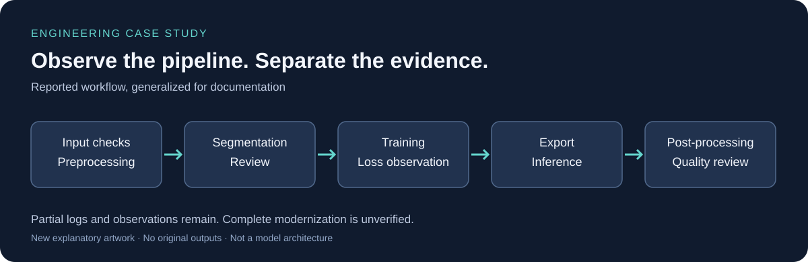

# Legacy Computer Vision Pipeline Modernization

**Engineering Case Study · Experiment Log · Modernization Design**

오래된 CV 학습·추론 파이프라인을 사용하면서 학습 설정, 품질 변화, GPU 자원, 실행 환경 문제를 관찰하고 현대화 방향을 검토한 개인 실험 기록입니다. 기존 동작을 유지하면서 바꿀 수 있는 부분을 이해하는 것이 목표였습니다. **전체 마이그레이션은 완료하지 못했습니다.**

## Project overview

The study investigates modernization of a legacy computer vision pipeline while preserving behavioral compatibility. It covers training configuration, segmentation, runtime compatibility, GPU resource observations, reproducibility, and failure analysis. It is a retrospective study, not a completed migration or a validated performance improvement.

## 무엇이 남아 있는가

| 과거 실험·시도 | 현재 작성한 자료 |
|---|---|
| 학습 설정 설명과 일부 iteration/loss 출력 | 근거 유형을 구분한 실험 기록 |
| 증강 전환, 사전 학습 상태 재사용 시도 | 동작 보존 중심 현대화 설계 |
| 후처리 버전별 품질 차이와 메모리 부족 보고 | 직접 작성한 설명용 SVG 도식 |
| GPU 실행 공급자·웹 UI 의존성 오류 | 비실행 설정 예시와 CPU 측정 템플릿 |

과거 구현 코드는 보존되어 있지 않습니다. 현재의 설정·스크립트·도식은 **이번 문서화에서 새로 작성한 보조 자료**이며, 과거 사용 코드나 마이그레이션 결과물이 아닙니다.

## 대표 기록

- **증강 재활성화:** iteration 124,262 → 144,079 구간에서 두 손실 출력이 0.7716 / 0.5938 → 0.6546 / 0.4855로 감소했습니다. 후속 품질 문제 보고는 남아 있으며, 증강의 인과 효과나 품질 개선을 입증한 A/B 실험은 아닙니다.
- **배치 변경:** batch 8과 16에서 관찰한 반복 시간을 비교했지만 데이터 규모도 바뀌었습니다. 배치 증가로 처리량이 개선되었다고 단정하지 않습니다.
- **품질 차이 조사:** 여러 후처리 버전에서 경계·윤곽·색 일관성의 차이를 보고했습니다. 동일 조건 비교가 아니므로 버전 회귀는 의심 사항으로 남깁니다.
- **환경 문제:** PyTorch import 실패, ONNX Runtime 실행 공급자 초기화 오류, Gradio API schema 처리 경로의 예외가 대화 출력에 남아 있습니다. 부분 기동과 전체 정상 동작을 구분합니다.

## 문서 안내

| 문서 | 설명 |
|---|---|
| [문제 정의](docs/problem-definition.md) | 목표, 범위, 근거와 비목표 |
| [기존 파이프라인 분석](docs/legacy-pipeline-analysis.md) | 단계별 책임과 호환성 위험 |
| [실험 기록](docs/experiment-log.md) | 설정·수치·관찰·미확인 사항 |
| [실패 분석](docs/failure-analysis.md) | 증상, 검토한 가능성, 결론의 한계 |
| [성능 관찰](docs/performance-notes.md) | 배치·반복 시간·VRAM 해석 |
| [현대화 계획](docs/modernization-plan.md) | 현재 설계와 아직 수행하지 않은 검증 |
| [회고](docs/lessons-learned.md) | 학습한 판단 기준과 기록 보존 |

보조 자료: [설정 예시](configs/sanitized-example-config.yaml) · [측정 템플릿](scripts/benchmark_template.py) · [제안 아키텍처](diagrams/architecture.svg)

## 기여 범위와 한계

본인이 실행·설정 변경·문제 보고를 수행한 설명과, AI 보조 작업의 보고가 함께 남아 있습니다. 분석·작업 지시·리뷰에 AI 도구를 활용했습니다. 코드별 직접 작성 비중이나 전체 독자 구현을 입증하는 자료는 없습니다.

공개 자료는 기술적 내용을 선별해 다시 작성한 문서와 보조 예시입니다. 원래 응용의 상세 내용, 입력 자료, 실행 산출물, 원문 첨부물을 포함하지 않습니다. 도식은 실제 결과 화면이 아닙니다. 특정 기업 과제나 산업 제품의 개발·양산 적용 사례도 아닙니다.

정리일: 2026-09-21. 저장소의 커밋 날짜는 문서·보조 자료의 작성 날짜이며 과거 개발 시점이 아닙니다.
