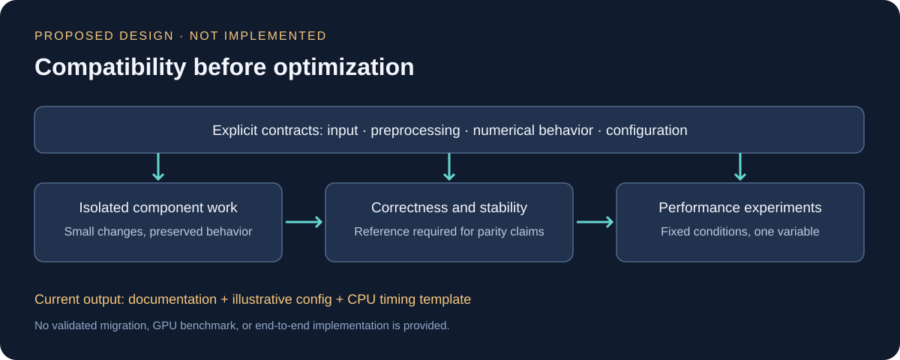

# 현재: Modernization plan

**설계 및 새 보조 템플릿 단계. 실행 가능한 전체 파이프라인은 없습니다.**

## 단계별 계획

| 단계 | 제안 작업 | 완료 판단에 필요한 근거 | 현재 상태 |
|---|---|---|---|
| 0 | 환경·입력·설정 의미 명세 | 변경 전 기준과 재실행 절차 | 문서상 항목 정리 |
| 1 | 작은 전처리 단위 재구현 | 독립 테스트와 중간 출력 비교 | 미구현 |
| 2 | 연산·상태 로딩 호환성 검토 | shape·값·설정 해석 비교 | 미수행 |
| 3 | 학습·추론·내보내기 연결 검증 | 단계별 및 통합 결과 | 미수행 |
| 4 | 장시간 안정성 확인 | 오류·자원 사용 기록 | 미수행 |
| 5 | 병목별 최적화 실험 | 고정 조건의 반복 측정 | 미수행 |

기준 구현을 확보하지 못하면 독립 예제의 기능 확인까지만 가능합니다. 그 결과로 과거 구현과의 동등성을 주장하지 않습니다.

## 보존할 동작 기준

- 전처리의 보간·경계·정규화·순서
- 무작위 처리의 위치와 증강 규칙
- 텐서 배치·차원·패딩·활성화
- 손실 정의·갱신 규칙·설정 해석
- 저장 상태 로딩과 내보내기 연결

과거 논의에서는 환경 교체와 알고리즘 변경을 한 작업에 섞지 않는 방향을 요청했습니다. 현재 이를 작업별 목적·허용 변경·비변경 범위·수용 조건으로 정리했습니다.

## 확장 방향 (미검증)

이번 검토에서는 얼굴 이미지 도메인에 한정되지 않고, 사물 인식이나 3D 환경 인식과 같은 다른 비전 태스크에도 구조를 재사용할 수 있는지를 함께 고려했습니다. 구체적으로는 아래 항목이 도메인에 종속되지 않도록 분리 가능한지를 설계 단계에서 검토했습니다.

- 입력 전처리(정규화·크기 조정)와 도메인 특화 증강의 분리
- 인코더-디코더 구조와 출력 헤드(태스크별 손실·후처리)의 분리
- 설정 스키마에서 도메인 파라미터와 파이프라인 파라미터의 분리

이는 **PLAN**입니다. 실제로 다른 도메인 데이터로 학습하거나 검증한 기록은 없으며, 위 단계별 계획(0~5단계)이 기준 구현조차 확보하지 못한 현재 상태에서는 도메인 일반화 여부를 판단할 근거도 없습니다. 구조 설계 시 고려한 방향성으로만 표시합니다.

## 정확성과 성능을 분리

먼저 명시적인 FP32 기준을 두는 방안을 제안합니다. 혼합 정밀도, 그래프 최적화, 입력 공급·전송 변경은 이후 하나씩 검토합니다. 허용 오차와 성능 목표 수치는 측정 기준을 확보하기 전에는 정하지 않습니다.

## 현재 보조 자료

- [설정 예시](../configs/sanitized-example-config.yaml): 일반화한 항목과 관찰된 일부 선택값을 담은 설명용 스키마. 완전한 과거 preset이나 실행 설정이 아닙니다.
- [측정 템플릿](../scripts/benchmark_template.py): 새로 작성한 CPU 데모·시간 집계 함수. 장치 연결, CV 처리, 학습은 미구현입니다.
- 두 SVG: 이번 문서화에서 직접 작성한 추상 도식. 원본 화면이나 실제 모델 구조의 복제본이 아닙니다.

전체 재구현 성공이나 성능 개선을 보여주기 위해 나중에 만든 예시를 과거 산출물로 제시하지 않습니다.
